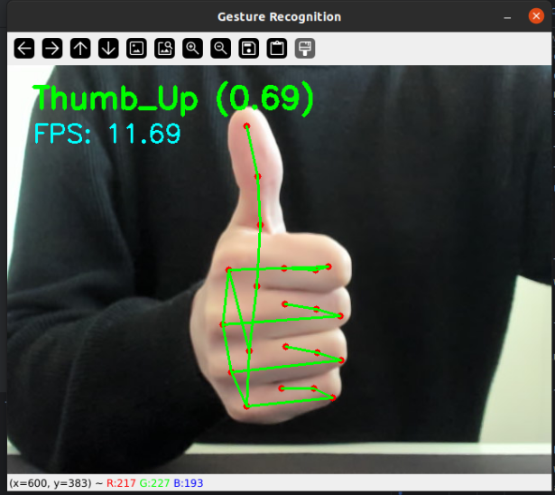

<p align="center">
 <a href="https://github.com/dav354/seminar/actions">
    
  </a>
  <br/>
  <br/>
  
</p>

# Schnick Schnack Schnuck Pepper

## Schitt 0
- thema definieren
- api pepper anschauen
- ai vision modell finden (gesten)
- python pepper bibliothek

## Schritt 1 (prototyp)
- Kamera
- Pi mit Coral TPU
- Gestenerkennung der Hand
- Schnick Schack Schnuck business logik

## Schritt 2
- mit pepper zum laufen bekommen
- compute immer noch auf pi & coral tpu
- pepper kameras nutzen
- pepper und pi via wifi verbinden

## Todo



- [x] gesture recognition
- [ ] other/custom model for rock, paper, scissors
- [ ] game logic
- [ ] video stream
- [ ] tflight models

## Venv

```shell
python3.10 -m venv .venv
source .venv/bin/activate
pip install --upgrade pip
pip install -r requirements.txt
```

## Prerequisites
- install python 3.10

https://coral.ai/docs/edgetpu/compiler/

https://coral.ai/docs/accelerator/get-started/#install-the-edge-tpu-runtime

## Install edge tpu repo

```shell
echo "deb https://packages.cloud.google.com/apt coral-edgetpu-stable main" | sudo tee /etc/apt/sources.list.d/coral-edgetpu.list
curl https://packages.cloud.google.com/apt/doc/apt-key.gpg | sudo apt-key add -
sudo apt update
sudo apt install edgetpu-compiler
```

## Pi installation with ansible

To setup the pi there is a small ansbile script. To run it you need to install ansible.

> [!NOTE]
> This step assumes you installed ubuntu24.04

1. First install the required galaxy roles:
  
  ```shell
  ansible-galaxy install geerlingguy.docker
  ```

2. Now you can execute the the playbooK:

  ```shell
  ansible-playbook -i '192.168.0.188,' -u david setup_pi.yml -Kk --diff
  ```

## Docker context

to use docker on the pi create a new docker context

```shell
docker context create pi \
  --docker "host=ssh://david@192.168.0.188"
```

then to use it

```shell
# See all your contexts
docker context ls

# Switch to the Pi
docker context use pi
```

to switch back

```shell
docker context use default
```

## Manual Build

to build the docker image locally run:

```shell
docker buildx build \
  --builder multiarch-builder \
  --platform linux/arm64 \
  --load \
  -t seminar:latest \
  .
```